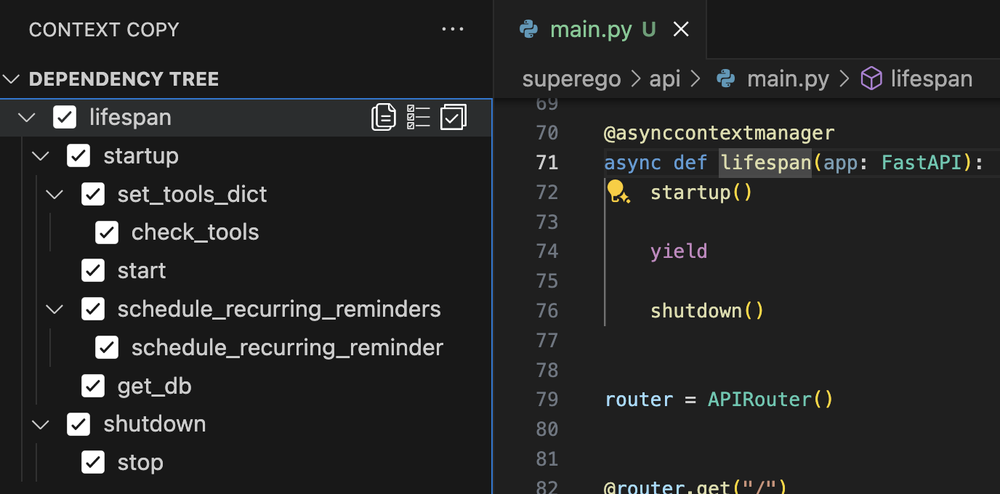
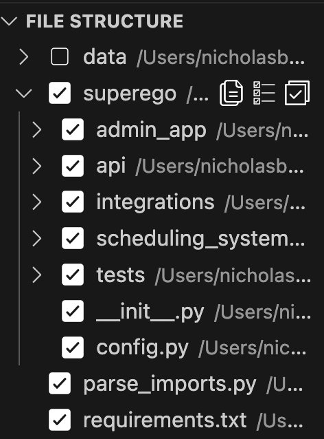

# Contextual Copy

Contextual Copy simplifies the process of analyzing and managing code dependencies in your Python projects. With just a few clicks, you can generate a visual dependency tree of your codebase, toggle dependencies to include or exclude them, and effortlessly copy detailed dependency information to your clipboard. This makes it easy to provide contextual information to Large Language Models (LLMs) for better understanding and assistance with your code.

## Features

### 1. Build Dependency Tree



Generate a comprehensive dependency tree that visualizes outgoing function calls within your Python project. This feature allows you to:

  

**Toggle Function Code and Called Functions**  
Include or exclude specific function codes and their dependencies from the copied output.

  

**Toggle Called Functions**  
Control the inclusion of called functions in the copied output.


**Copy Dependency Information**  
Easily copy the selected dependency information to your clipboard. *(Note: This button is only available for items that are toggled on.)*

### 2. Copy Files by File Structure



Navigate through a hierarchical tree that mirrors the structure of your workspace files. This feature enables you to:


**Toggle File Selection**
Select or deselect entire files or specific sections of your file structure.


**Toggle File Children**
Manage the inclusion of child files within the selected directories.


**Copy Selected Files**
Copy the entire content of selected files to your clipboard with ease.

### 3. Copy Workspace Structure

Easily copy a representation of your workspace structure, excluding modules that start with `.` or `__`. This is particularly useful for providing a clear overview of your project’s architecture.

**Example Output:**

```plaintext
├── app
│   ├── core
│   │   ├── settings.py
│   │   └── utils.py
│   ├── features
│   │   ├── auth.py
│   │   └── dashboard.py
│   ├── models
│   │   └── user.py
│   └── tests
│       ├── test_auth.py
│       └── test_dashboard.py
├── config
│   └── config.yaml
├── requirements.txt
├── Dockerfile
└── README.md
```

## Requirements

- **Visual Studio Code**: Version 1.93.0 or higher.
- **Python**: Ensure Python is installed and accessible in your system's PATH. You can configure the Python interpreter path in the extension settings if needed.

## Extension Settings

This extension contributes the following settings:

- `contextualCopy.pythonPath`:  
  **Type**: `string`  
  **Default**: `python`  
  **Description**: Path to the Python interpreter to use for parsing imports. Defaults to `'python'` from the system PATH.

## Known Issues

- **Limited to Python Projects**: Currently, Contextual Copy is designed exclusively for Python projects. Support for other languages may be added in future releases.
- **Large Projects Performance**: Extremely large projects may experience performance delays when building dependency trees.

If you encounter any issues, please check the [Issues](https://github.com/nick-boveri/context-copy/issues) page before reporting a new one.

## Release Notes

### 0.0.1

- Initial release of Contextual Copy.
- Features:
  - Build Dependency Tree
  - Copy Files by File Structure
  - Copy Workspace Structure
- Configuration for Python interpreter path.
- Integrated with Visual Studio Code's activity bar.


**Enjoy using Contextual Copy!**

# License

[MIT](LICENSE)

# Author

Nicholas Boveri

# Acknowledgements

Special thanks to the contributors and the open-source community for their support.

# Contact

For any questions or feedback, please open an issue on the [GitHub repository](https://github.com/nckbo/context-copy).